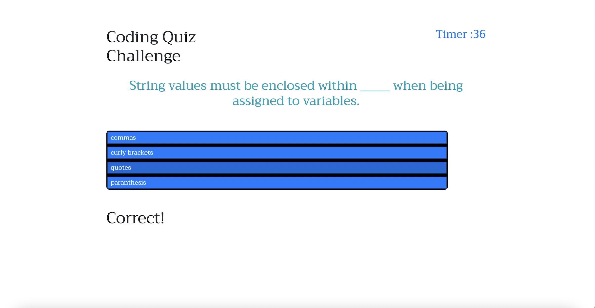

# Java-Code-Quiz

## Table of Contents
* General Info
* Technologies Used
* Screenshot
* Project Status
* Link to Deployed Application

## General Information
* This challenge was to create a multiple choice quiz with a timer 
that stored the highest scores by submitting the user's initials. 

## Technologies Used
* HTML
* CSS
* Javascript

## Screenshot

## Project Status
Project is: Completed

## Link to Deployed Application
https://ehamzapour.github.io/Java-Code-Quiz/